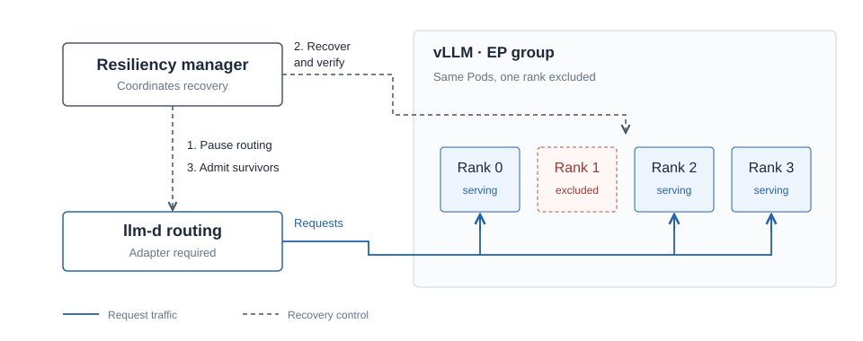

# llm-d-resiliency-manager

Recovery coordination for expert-parallel inference groups in [llm-d](https://github.com/llm-d/llm-d).

When a worker fails, the manager pauses routing, asks vLLM to exclude the failed
rank, checks survivor inference, and restores routing to the surviving ranks.
LWS retains its normal group reset policy.



Proposed for llm-d incubation. Observation is the default; active recovery uses
vLLM's FT API and a [routing adapter](docs/routing.md).

## Getting started

Requires Go 1.26.8 or newer and an existing group exposing the vLLM FT API.
Edit the example to select one EP group and its rank layout.

```sh
make build
cp config/example.yaml config.local.yaml
./bin/manager --config=config.local.yaml \
  --kubeconfig=/path/to/kubeconfig --context=your-context
```

See [deployment and recovery](docs/design.md) for Kubernetes setup and active mode.

## Scope

One group, DP=EP and TP=1, with at most one non-master rank removed. Recovery
requires redundant experts and a supervisor that keeps the container alive
without relaunching failed children. Pod replacement remains with LWS.

## Development

```sh
make test vet build
```

CI covers controller behavior and simulated HTTP recovery. This manager has not
yet been validated with a live GPU workload and a real routing adapter.

[Contributing](CONTRIBUTING.md) · [Security](SECURITY.md) · [Apache 2.0](LICENSE)
