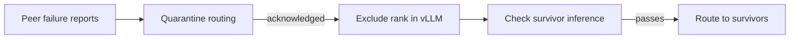

# llm-d-resiliency-manager

A controller for coordinating recovery of an expert-parallel inference group.

The experimental vLLM FT path can exclude a failed rank and resume on the survivors.
Something outside the
engine still has to decide when to do that, send the same recovery operation to
every survivor, and keep routing away from the excluded rank. This project owns
that coordination.

**Experimental.** This is a personal repository for discussion with llm-d
maintainers. It has not been accepted into the llm-d incubator.

## Scope

The first version manages one EP group and removes at most one non-master rank.
It observes by default. Active recovery requires the experimental vLLM FT API,
redundant experts, a supervisor that keeps the Pod alive without relaunching failed
children, and a routing adapter implementing our
[acknowledgement contract](docs/routing.md).
That routing adapter is an integration requirement; this repository currently
provides its client and contract, not a stock llm-d EPP implementation.

LWS keeps its normal `RecreateGroupOnPodRestart` policy. The manager does not patch
LWS, delete Pods, or restart containers. Container and Pod failures still fall
back to group replacement. A stalled process can remain allocated after exclusion.



Replacement and rejoin belong to [phase 2](docs/phase-2.md), after the necessary
LWS and engine lifecycle support is available. They are not implemented here.

## Try observation

Use Go 1.26.8 or newer. Start with an existing group that exposes the
[supported FT status API](docs/design.md#engine-compatibility).

```sh
make build
cp config/example.yaml config.local.yaml
# Set namespace, selector, rank layout and ports for one group.
./bin/manager --config=config.local.yaml \
  --kubeconfig=/path/to/kubeconfig --context=your-context
```

Observation only lists Pods and reads engine status. It does not acquire a Lease,
write a journal, change routing, or send recovery commands. The selector must
identify one EP group, including its LWS group index when there are several replicas.

For Kubernetes deployment, build and push an image to your registry, set its name
in `deploy/manager.yaml`, and edit `deploy/config.yaml` and the namespace in
`deploy/kustomization.yaml`:

```sh
make image IMAGE=your-registry/llm-d-resiliency-manager:dev
docker push your-registry/llm-d-resiliency-manager:dev
kubectl --kubeconfig=/path/to/kubeconfig --context=your-context apply -k deploy
```

The namespace must already exist. Deployment defaults grant only Pod listing.
See [active recovery](docs/design.md#enabling-recovery) before changing the mode.

## Development

```sh
make test vet build
```

The tests cover recovery decisions, interrupted dispatch, membership changes, and
an HTTP integration with simulated engines and routing. This Go manager has not
yet been validated against a live GPU workload. Earlier engine experiments and
the remaining acceptance tests are recorded in [validation](docs/validation.md).

The repository follows the small Go component structure used by
[fast-model-actuation](https://github.com/llm-d-incubation/llm-d-fast-model-actuation)
and [batch-gateway](https://github.com/llm-d-incubation/batch-gateway):

| Path | Purpose |
| --- | --- |
| `cmd/manager` | Configuration, leader election and reconciliation loop |
| `pkg/recovery` | Failure policy, state machine and adapter interfaces |
| `internal/engine` | vLLM status, recovery dispatch and inference checks |
| `internal/routing` | Routing publication client |
| `internal/kubernetes` | Pod discovery and operation journal |
| `deploy` | Namespaced deployment and opt-in recovery permissions |
| `test/integration` | HTTP recovery simulation |

See [CONTRIBUTING.md](CONTRIBUTING.md) for contribution guidance. Licensed under
[Apache 2.0](LICENSE).
